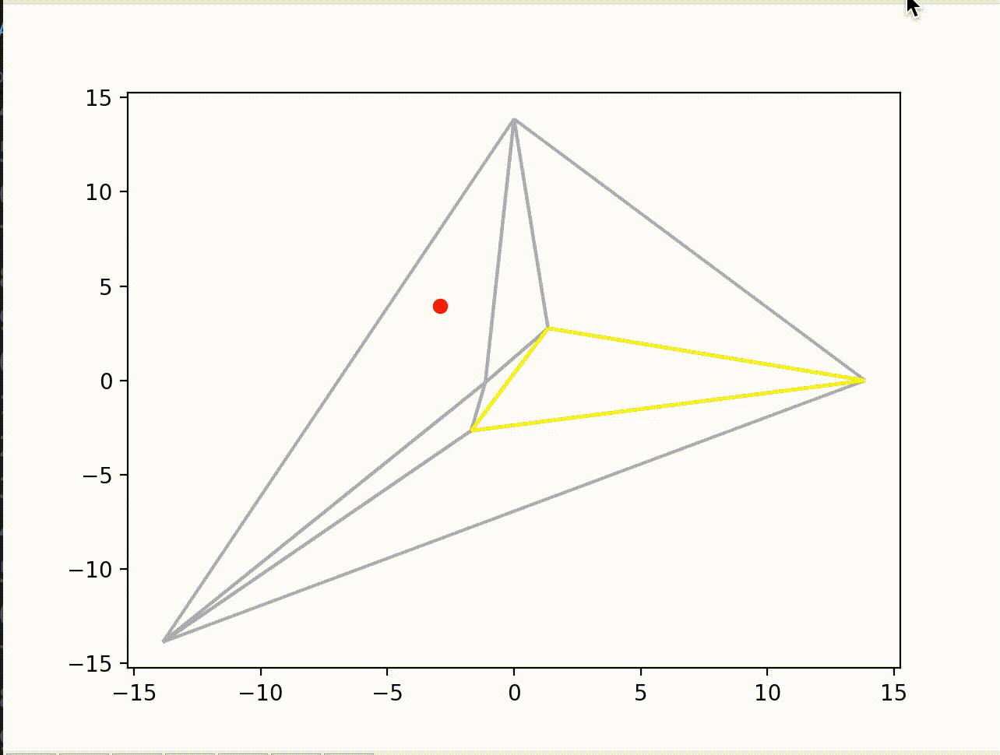
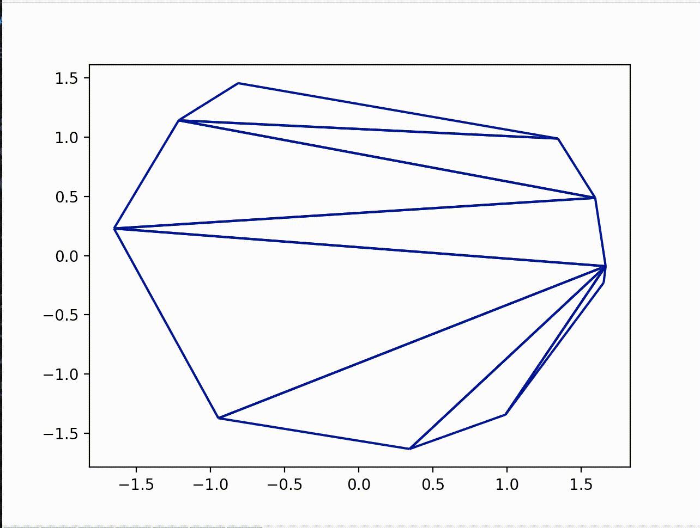
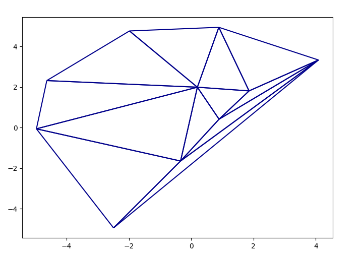

# Delaunay Triangulation Py

## Table of Contents
- [Delaunay Triangulation Py](#delaunay-triangulation-py)
  - [Table of Contents](#table-of-contents)
  - [General Information](#general-information)
  - [Technologies Used](#technologies-used)
  - [Point Generating](#point-generating)
  - [Algorithm](#algorithm)
  - [Visualization](#visualization)
  - [Time testing](#time-testing)
  - [Examples](#examples)
  - [Setup and run](#setup-and-run)
  - [Credits](#credits)

## General Information
Created as a final assignment for the Geometric Algorithms class at the AGH University of Science and Technology, the project centers around implementing the construction of a Delaunay (Delone) triangulation for a given set of discrete points on a 2D surface, as well as visualizing the algorithm step by step.

As of now the app and comments are written in Polish.

## Technologies Used
- **Python 3**
- numpy
- matplotlib

## Point Generating

The project comes with code allowing point generation of specified type: random, on circle, at rectangle's vertices and diagonals etc. The app also allows manual point placement with cursor.

## Algorithm

We implemented the algorithm for finding the triangulation in two variants, both of which can be classified as iterative methods, as they adjust current state of triangulation with every point being inserted:

* variant #1: New point being added to the structure causes the triangle containing it to split into smaller ones, then edges are to be "legalized" if necessary to satisfy the characteristics of a Delaunay Triangulation
* variant #2: classic Bowyer-Watson method - as the new point is being inserted into the structure, a multitude of triangles are to be deleted (all of the ones which circumcircles contain the new point), then new triangles are added to fill created convex hole.
  

## Visualization

While creating the triangulation we construct animation Scenes to visualize the algorithm step by step.

## Time testing

Apart from implementing and visualizing the algorithm, our projected involved carrying out multiple experiments to compare used methods on different data sets. Both of the variants of the incrementing algorithm resulted in similar time complexities.

## Examples

## Setup and run
You can use this project by importing the Triangulation class from triangulation_speed.py or by using the console app by simply running app.py in a Python 3 interpreter.

## Credits

Created by:
[@mhawryluk](https://www.github.com/mhawryluk) and [@Singularity23x0](https://www.github.com/Singularity23x0)

Based on the book: "Computational Geometry: Algorithms and Applications" by Mark de Berg.
